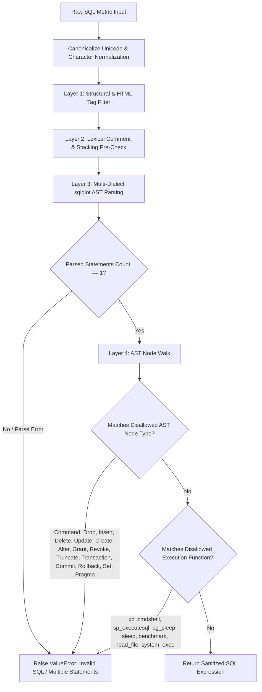

<!--
Licensed to the Apache Software Foundation (ASF) under one
or more contributor license agreements.  See the NOTICE file
distributed with this work for additional information
regarding copyright ownership.  The ASF licenses this file
to you under the Apache License, Version 2.0 (the
"License"); you may not use this file except in compliance
with the License.  You may obtain a copy of the License at

  http://www.apache.org/licenses/LICENSE-2.0

Unless required by applicable law or agreed to in writing,
software distributed under the License is distributed on an
"AS IS" BASIS, WITHOUT WARRANTIES OR CONDITIONS OF ANY
KIND, either express or implied.  See the License for the
specific language governing permissions and limitations
under the License.
-->

# ADR 004: AST-Based SQL Expression Allowlisting and Sanitization for MCP Services

## Metadata
- **Status**: Accepted
- **Status History**:
  - `Proposed`: 2026-09-02 (Phase 8 Implementation)
  - `Accepted`: 2026-09-02 (Phase 8 Security Review)
- **Approver**: Platform Engineering & Security Architecture
- **Baseline Git Commit**: `ac3c158c41` (Upstream Apache Superset `master`)
- **Target File**: `superset/mcp_service/utils/sanitization.py`
- **Supersedes**: N/A
- **Related ADRs**:
  - [ADR 001: Preset-Like Capabilities Extension Strategy](file:///home/bi-tool-ryobilao/Documents/superset/docs/adr/ADR-001-preset-like-extensions-strategy.md)
  - [ADR 002: VizType Enum Extension Policy for Visualization Plugins](file:///home/bi-tool-ryobilao/Documents/superset/docs/adr/ADR-002-viztype-enum-extension.md)
  - [ADR 003: Table Interaction and Performance Architecture](file:///home/bi-tool-ryobilao/Documents/superset/docs/adr/ADR-003-table-interaction-and-performance-architecture.md)

---

## Context
In Apache Superset's Model Context Protocol (MCP) and AI Assistant architecture, tools such as `generate_chart`, `query_dataset`, and `update_dataset_metric` accept ad-hoc metric calculations (e.g. `SUM(sales_amount) / NULLIF(COUNT(*), 0)`). 

Prior to Phase 8, `sanitize_sql_expression()` in `superset/mcp_service/utils/sanitization.py` relied on regular expression pattern matching and keyword denial lists (`\b(DROP|DELETE|INSERT|UPDATE|CREATE|ALTER|EXEC|GRANT|TRUNCATE)\b`).

While regex blocklists catch standard multi-statement attacks, keyword filtering exhibits well-known architectural vulnerabilities:
1. **Grammar Evasion**: Semicolon-free SQL dialect statements, backtick identifiers, and nested subquery tricks can evade regex heuristics.
2. **False Positives**: Legitimate business metrics containing column names or aliases like `is_deleted` or `drop_off_rate` can trigger regex token false positives.
3. **Dialect Divergence**: Stored procedure syntax (e.g., T-SQL `EXEC sp_helpdb`) or dialect-specific execution primitives require comprehensive grammar awareness rather than ad-hoc regex patching.

To achieve robust, defense-in-depth protection against SQL injection and out-of-spec AI tool generation, the SQL sanitization layer required structural Abstract Syntax Tree (AST) validation.

---

## Decision Drivers
- **Defensible Security Guarantee**: Deterministically block all Data Definition Language (DDL), Data Manipulation Language (DML), privilege escalation, session modification, and administrative command functions.
- **Support for Rich Analytics Expressions**: Allow full mathematical operations, aggregations, `CASE/WHEN` statements, `COALESCE`, `NULLIF`, type casts (`::numeric`), and multi-dialect identifier quoting.
- **Statement Boundary Enforcement**: Ensure that input strings parse into exactly **one** discrete expression, making statement stacking and trailing semicolon injection architecturally impossible.
- **Minimal Core Patch Footprint**: Confine the modification cleanly to `superset/mcp_service/utils/sanitization.py` using `sqlglot`, an established, fast SQL parser already present in the Superset dependency tree.

---

## Decision

We formally authorize and integrate `_validate_sql_expression_ast()` into `sanitize_sql_expression()` within `superset/mcp_service/utils/sanitization.py`.

### Architecture of `_validate_sql_expression_ast()`

### Implementation Specification:
1. **Multi-Dialect Parse Strategy**: Parses expressions across standard, PostgreSQL, MySQL (backtick support), and SQLite grammars.
2. **Single Expression Assertion**: Enforces `len(parsed_statements) == 1`, preventing SQL statement stacking (`1; SELECT 2`).
3. **AST Node Type Denylist**: Explicitly rejects AST classes:
   - `exp.Command` (dialect executive commands like `EXEC ...`)
   - `exp.Drop`, `exp.Create`, `exp.Alter`, `exp.TruncateTable` (DDL)
   - `exp.Insert`, `exp.Delete`, `exp.Update` (DML)
   - `exp.Grant`, `exp.Revoke` (Privilege mutation)
   - `exp.Transaction`, `exp.Commit`, `exp.Rollback` (Transaction hijacking)
   - `exp.Set`, `exp.Pragma` (Session state changes)
4. **Function Execution Blacklist**: Rejects anonymous and standard function calls to dangerous primitives: `xp_cmdshell`, `sp_executesql`, `pg_sleep`, `sleep`, `benchmark`, `load_file`, `into_outfile`, `system`, and `exec`.

---

## Consequences

### Positive
- **Structural Immunity**: Completely prevents SQL injection escapes through statement splitting or DDL/DML injection in MCP metric expressions.
- **Zero Regex False-Negatives**: AST nodes represent true syntactic semantics regardless of whitespace, indentation, or comments.
- **Multi-Dialect Reliability**: Correctly processes complex dialect idioms (e.g., MySQL backticks, PostgreSQL casting operators).
- **Core Maintainability**: Implemented in 80 lines of clean, self-contained Python without introducing new external dependencies.

### Negative / Trade-offs
- **Parse Overhead**: Parsing AST via `sqlglot` takes ~0.05ms per metric expression, which is negligible for interactive and MCP workloads.

---

## Guidelines for Future Core Security Hardening
1. Prefer AST-level validation over regex pattern blacklisting for all domain-specific language (DSL) inputs (SQL, Jinja, GraphQL).
2. Maintain multi-dialect compatibility when parsing customer-supplied database expressions.
3. Every deliberate core security hardening must be accompanied by an ADR and automated unit tests.
