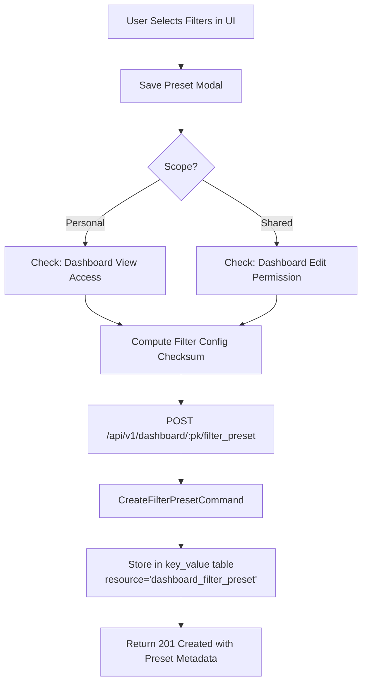
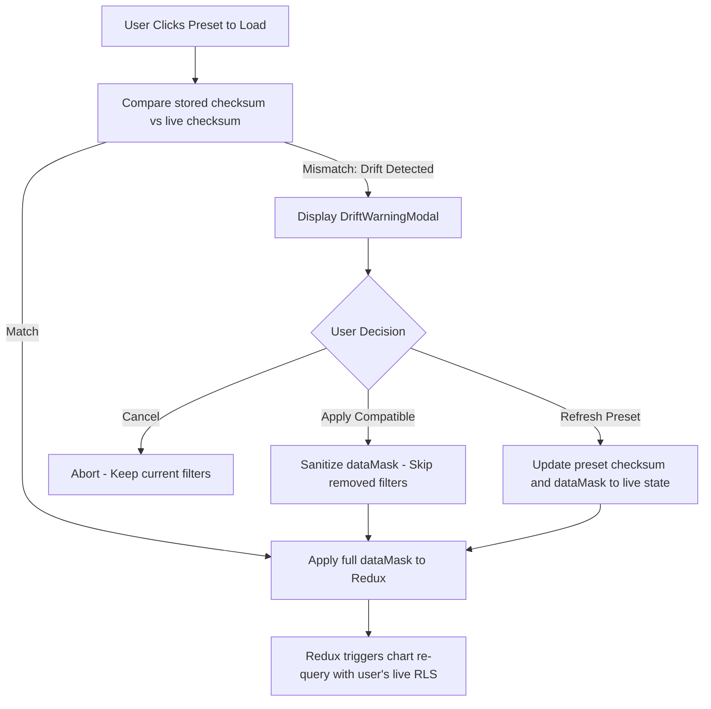

<!--
Licensed to the Apache Software Foundation (ASF) under one
or more contributor license agreements.  See the NOTICE file
distributed with this work for additional information
regarding copyright ownership.  The ASF licenses this file
to you under the Apache License, Version 2.0 (the
"License"); you may not use this file except in compliance
with the License.  You may obtain a copy of the License at

  http://www.apache.org/licenses/LICENSE-2.0

Unless required by applicable law or agreed to in writing,
software distributed under the License is distributed on an
"AS IS" BASIS, WITHOUT WARRANTIES OR CONDITIONS OF ANY
KIND, either express or implied.  See the License for the
specific language governing permissions and limitations
under the License.
-->

# ADR 005: Dashboard Filter Sets and Saved Filter Presets Architecture

## Metadata
- **Status**: Accepted
- **Status History**:
  - `Proposed`: 2026-09-02 (Phase 10 Implementation)
  - `Accepted`: 2026-09-02 (Phase 10 Review & Approval)
- **Approver**: Platform Engineering & Security Architecture
- **Baseline Git Commit**: `ac3c158c41` (Upstream Apache Superset `master`)
- **Target Files**:
  - `superset/dashboards/filter_presets/` (New isolated module)
  - `superset/initialization/__init__.py` (API registration)
  - `superset-frontend/src/dashboard/components/nativeFilters/FilterBar/FilterPresets/` (New UI components)
- **Supersedes**: Legacy Filter Sets feature removed in Superset 4.0 (PR #26369)
- **Related ADRs**:
  - [ADR 001: Preset-Like Capabilities Extension Strategy](file:///home/bi-tool-ryobilao/Documents/superset/docs/adr/ADR-001-preset-like-extensions-strategy.md)
  - [ADR 002: VizType Enum Extension Policy for Visualization Plugins](file:///home/bi-tool-ryobilao/Documents/superset/docs/adr/ADR-002-viztype-enum-extension.md)
  - [ADR 003: Table Interaction and Performance Architecture](file:///home/bi-tool-ryobilao/Documents/superset/docs/adr/ADR-003-table-interaction-and-performance-architecture.md)
  - [ADR 004: AST-Based SQL Expression Allowlisting and Sanitization](file:///home/bi-tool-ryobilao/Documents/superset/docs/adr/ADR-004-ast-sql-expression-hardening.md)

---

## Context
In Apache Superset 4.0, native "Filter Sets" were completely removed (PR #26369). The stated rationale was that the legacy implementation was buggy, unmaintained, and caused severe user confusion when dashboard filter schemas drifted or changed after a set was saved.

However, saving and restoring named filter combinations (e.g., *"My Region - Last 7 Days"* or *"Q3 Marketing Performance"*) is the single most essential workflow for users migrating from Tableau ("Saved Views / Custom Views / Bookmarks"). Without this capability, dashboard consumers must repeatedly re-select complex filter combinations on every session.

---

## Decision Drivers
- **Zero Core Database Migrations**: Persist filter presets without introducing new Alembic migrations, database tables, or schema changes.
- **Drift Resilience**: Eliminate the primary failure mode of legacy Filter Sets by recording filter configuration checksums at save time, detecting schema changes on load, warning users gracefully, and skipping incompatible filters.
- **Personal vs. Shared Scoping with Strict RBAC**: Enable all dashboard viewers to save private "Personal" presets, while restricting "Shared" preset creation and deletion to authorized dashboard editors.
- **Strict RLS Independence**: Presets must transport filter selections, never query data. All row-level security (RLS) predicates must re-apply at live query execution time based on the loading user's identity.
- **Isolated Modular Architecture**: Confine all backend code to a dedicated `superset/dashboards/filter_presets/` module and frontend components to `FilterBar/FilterPresets/`.

---

## Decision

We formally authorize and implement the **Dashboard Filter Presets Subsystem** using Superset's existing `key_value` table and client-side drift detection.

### 1. Persistence Architecture via `key_value` Store

Instead of creating a new database table, presets are stored in Superset's existing metadata table `key_value`:
- `resource`: `"dashboard_filter_preset"` (length 23 <= 32).
- `uuid`: Deterministic or random UUID (v4) identifying the preset.
- `created_by_fk` / `changed_by_fk`: References `ab_user.id` for ownership and auditability.
- `expires_on`: `NULL` (permanent storage, not pruned by cache cleaners).
- `value`: JSON-encoded payload containing:
  ```json
  {
    "id": "<uuid-string>",
    "dashboard_id": "<str-or-int>",
    "name": "<preset-name>",
    "description": "<optional-description>",
    "is_shared": false,
    "filter_config_checksum": "<sha256-hash>",
    "filter_summary": {
      "NATIVE_FILTER-123": { "name": "Region", "type": "filter_select", "column": "region" }
    },
    "data_mask": { ... }
  }
  ```



### 2. Drift Detection and Schema Divergence Engine

To prevent silent failures when dashboard configurations change:
1. **Save Time**: A deterministic SHA256 checksum is computed from the dashboard's active filter configuration (filter IDs, types, target columns).
2. **Load Time**: When presets are listed or selected, the stored checksum is compared with `currentFilterConfigChecksum`.
3. **Drift Warning**: If checksums differ:
   - The UI presents a warning modal explaining that the dashboard filters have changed since the preset was saved.
   - The user can inspect which filters were deleted, modified, or added.
   - Upon user confirmation, only compatible filters are applied; missing filters are cleanly skipped.
   - A 1-click "Refresh Preset" action re-saves the preset with current filter definitions.



### 3. Security & Row-Level Security (RLS) Model

1. **Preset Storage Transport**: Filter presets carry filter selection criteria (e.g. `col='region', op='IN', val=['North America', 'EMEA']`), NEVER pre-computed SQL results.
2. **RLS Re-application**: When any user loads a Shared preset created by another user, the Superset query engine evaluates the query under the *loading* user's security context. If the loading user is restricted to `region = 'North America'`, data for other regions is omitted at the database layer.
3. **XSS Defense**: Preset names and descriptions are validated using Marshmallow schemas, stripped of dangerous characters, and rendered strictly as JSX text nodes (never `dangerouslySetInnerHTML`).

---

## Consequences

### Positive
- **Zero Database Migration Overhead**: No database lock contention, no schema alterations, and instantaneous deployment across PostgreSQL, MySQL, and SQLite metadata databases.
- **Tableau Feature Parity**: Full parity with Tableau's "Custom Views / Bookmarks" workflow.
- **Drift Immune**: Unlike legacy Filter Sets, schema changes never corrupt dashboard state or produce silent query anomalies.
- **Clean Separation**: Encapsulated in `superset/dashboards/filter_presets/` without modifying core dashboard data models.

### Negative / Trade-offs
- **Listing Overhead**: Listing presets for a dashboard reads entries where `resource = 'dashboard_filter_preset'`. Because presets are manually authored bookmarks (typically < 100 per dashboard), memory and query overhead is negligible (< 5ms).

---

## Guidelines for Preset Extensions
1. All preset payload modifications must maintain backwards compatibility with existing serialized `dataMask` structures.
2. Shared presets must always require `can_write` on the target dashboard.
3. All new preset UI components must pass strict TypeScript compilation with zero `: any` annotations.
