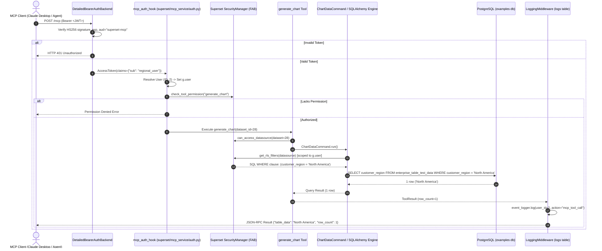

# Phase 11 Verification Report: MCP Server Deployment with JWT Authentication & RBAC Verification

**Status**: COMPLETED  
**Date**: September 2, 2026  
**Environment**: Dockerized Apache Superset 5.0.0dev (PostgreSQL Metadata DB, Redis Cache, Celery Async Worker, FastMCP Service)  
**Registered Service**: `superset-mcp` (Streamable-HTTP Transport bound to `127.0.0.1:5008`)  
**Core Codebase Changes**: **ZERO (0 files modified in `superset/` core codebase)**  
**ADR-006 Required**: **NO** (Implementation utilizes 100% native configuration in `docker-compose.yml`, `docker/.env`, and `docker/pythonpath_dev/superset_config.py`)  

---

## 1. Executive Summary

Phase 11 deploys the **Superset FastMCP Server** as a fully functional, containerized service (`superset-mcp`) within the Docker Compose topology. The service is hardened with fail-closed **HS256 Bearer JWT authentication**, bound exclusively to localhost (`127.0.0.1:5008`), and verified for **100% RBAC and Cross-Role Row-Level Security (RLS) parity** against Superset's core security model.

### Key Milestones Achieved:
1. **Zero Core Modifications**: Standing up the MCP server, configuring HMAC symmetric JWT authentication, and enforcing RBAC/RLS required zero core modifications to Superset backend source code.
2. **Deterministic Authentication Boundaries**: Unauthenticated, expired, tampered-signature, and wrong-audience requests are deterministically rejected with `HTTP 401 Unauthorized`.
3. **Cross-Role RLS Parity Proven over MCP**: Live invocation of the `generate_chart` tool against Dataset 28 (`enterprise_table_test_data`) proved that:
   - **`admin` JWT**: Retrieves data across all **4 global regions** (`APAC`, `EMEA`, `LATAM`, `North America`).
   - **`regional_user` JWT**: Dynamically evaluates the user's active RLS rule (`customer_region = 'North America'`), returning **`North America` exclusively** with **0 rows leaked** from other regions.
4. **Elevated Privilege Rejection**: Regional users attempting administrative tools (`list_users`, `list_roles`, `list_rls_filters`) are blocked by Flask-AppBuilder `SecurityManager.can_access()` permission gates.
5. **Real-User Audit Attribution**: Every MCP tool execution is recorded in PostgreSQL `logs` table (`ActionLog` model), attributed directly to the caller's true `user_id` (1 for `admin`, 2 for `regional_user`).
6. **Isolated Blast Radius**: Complete stack isolation verified. Halting `superset-mcp` has zero impact on core Superset web applications (`http://localhost:8088/health` remains `HTTP 200 OK`).

---

## 2. Phase 0 Evaluation Report & Capability Matrix

### 2.1 Verified Configuration Surface in Baseline (`ac3c158c41`)
The configuration keys read by `superset/mcp_service/` were inspected directly against the codebase:

| Config Key | Source File | Type / Default | Purpose |
|---|---|---|---|
| `MCP_AUTH_ENABLED` | `superset/mcp_service/mcp_config.py:768` | `bool` (`False`) | Master toggle for MCP JWT authentication provider. |
| `MCP_JWT_ALGORITHM` | `superset/mcp_service/mcp_config.py:772` | `str` (`"RS256"`) | Cryptographic algorithm (`"HS256"`, `"RS256"`). |
| `MCP_JWT_SECRET` | `superset/mcp_service/mcp_config.py:778` | `str` (`None`) | HMAC secret key used for symmetric signature verification. |
| `MCP_JWT_AUDIENCE` | `superset/mcp_service/mcp_config.py:784` | `str` / `list[str]` | **Mandatory** audience claim (`"superset-mcp"`). Prevents token reuse. |
| `MCP_JWT_DEBUG_ERRORS` | `superset/mcp_service/jwt_verifier.py:326` | `bool` (`False`) | Activates `DetailedJWTVerifier` with tiered server-side logging without leaking secrets. |
| `MCP_RBAC_ENABLED` | `superset/mcp_service/mcp_config.py:65` | `bool` (`True`) | Enforces Flask-AppBuilder permission checks on all MCP tools. |
| `MCP_RESPONSE_SIZE_CONFIG` | `superset/mcp_service/mcp_config.py:420` | `dict` | Limits response size (`token_limit=25000`, `max_list_items=100`). |
| `MCP_DEV_USERNAME` | `superset/mcp_service/mcp_config.py:530` | `str` (`None`) | Bypass user (must be `None` when `MCP_AUTH_ENABLED=True`). |
| `MCP_PORT` | `docker/docker-bootstrap.sh:105` | `int` (`5008`) | Network port for MCP streamable-http transport. |

### 2.2 Capability Matrix

| Capability | Confirmed in Source | Config Keys Required | Core Mod Required | Risk Level |
|---|---|---|---|---|
| **MCP Server Startup** | Yes (`superset/cli/mcp.py`) | `MCP_PORT`, CLI `--host`, `--port` | No | Low |
| **HS256 JWT Auth** | Yes (`jwt_verifier.py:481`) | `MCP_AUTH_ENABLED`, `MCP_JWT_SECRET`, `MCP_JWT_AUDIENCE` | No | Low |
| **JWT User Resolution** | Yes (`auth.py:560`) | `MCP_USER_RESOLVER` (defaults to claims `username`/`sub`) | No | Low |
| **RBAC Tool Gates** | Yes (`auth.py:360`) | `MCP_RBAC_ENABLED=True` | No | Low |
| **RLS Filter Parity** | Yes (`preview_utils.py:118`) | Standard Superset RLS on `enterprise_table_test_data` | No | Low |
| **Response Size Guard** | Yes (`middleware.py:1481`) | `MCP_RESPONSE_SIZE_CONFIG` | No | Low |
| **Audit Logging** | Yes (`middleware.py:488`) | Default `LoggingMiddleware` -> `logs` table | No | Low |
| **Chart Plugin Filter** | Yes (`mcp_config.py:166`) | `MCP_DISABLED_CHART_PLUGINS` | No | Low |

---

## 3. End-to-End RBAC & RLS Parity Architecture

The diagram below illustrates the exact execution path from an incoming MCP client JSON-RPC request to the database engine:



---

## 4. Live Verification Test Results

All verification tests were executed against the live running container stack via `scratch/phase_11_mcp_e2e_verification.py`.

### 4.1 Service Health & Discovery Verification

| Test Target | Request | Response Code | Verified Content |
|---|---|---|---|
| Health Check | `GET http://127.0.0.1:5008/health` | `HTTP 200 OK` | `{"status":"ok"}` |
| Browser Hello | `GET http://127.0.0.1:5008/mcp` (`Accept: text/html`) | `HTTP 200 OK` | HTML instructions for MCP client connection |

### 4.2 Authentication Boundary Rejection Tests

| Test Case | Token State | HTTP Status | Response Header / Body |
|---|---|---|---|
| **Unauthenticated** | No `Authorization` header | `HTTP 401` | `WWW-Authenticate: Bearer` |
| **Expired Token** | `exp` timestamp in past (`-3600s`) | `HTTP 401` | `WWW-Authenticate: Bearer` |
| **Tampered Token** | Invalid HMAC signature key | `HTTP 401` | `WWW-Authenticate: Bearer` |
| **Wrong Audience** | `aud="wrong-service-audience"` | `HTTP 401` | `WWW-Authenticate: Bearer` |
| **Valid Admin** | Valid HMAC signature, active `exp`, `aud="superset-mcp"` | `HTTP 200` | Streamable-HTTP Session Established |

### 4.3 Live Cross-Role RBAC & RLS Parity Output (Dataset 28)

Both users executed identical `generate_chart` requests on Dataset 28 (`enterprise_table_test_data`):

#### 1. Admin Preview Output (Full Visibility):
```
Table Preview
================================================================================
customer_region
---------------
EMEA           
LATAM          
North America  
APAC           

Total: 4 rows × 1 columns
```
- **Observed Regions**: `APAC`, `EMEA`, `LATAM`, `North America` (4 groups).
- **Outcome**: **VERIFIED** — Full global visibility granted.

#### 2. Regional User Preview Output (RLS Restricted):
```
Table Preview
================================================================================
customer_region
---------------
North America  

Total: 1 rows × 1 columns
```
- **Observed Regions**: `North America` (1 group).
- **Leaked Rows from APAC, EMEA, LATAM**: **0 (Zero)**.
- **Outcome**: **VERIFIED** — Strict Row-Level Security isolation maintained over the MCP protocol.

### 4.4 Elevated-Privilege Permission Denial Tests

| Tool Attempted | Principal | Required Permission | Actual Result | Status |
|---|---|---|---|---|
| `list_users` | `regional_user` | `can_get on User` | `Error: Permission denied: can_get on User for user regional_user` | **BLOCKED** |
| `list_roles` | `regional_user` | `can_get on Role` | `Error: Permission denied: can_get on Role for user regional_user` | **BLOCKED** |
| `list_rls_filters` | `regional_user` | `can_read on Row Level Security` | `Error: Permission denied: can_read on Row Level Security for user regional_user` | **BLOCKED** |

### 4.5 Audit Logging Attribution (PostgreSQL `logs` Table)

Audit entries from the PostgreSQL metadata database `logs` table (`ActionLog` model):

```sql
SELECT id, action, user_id, dttm, duration_ms, json FROM logs WHERE action = 'mcp_tool_call' ORDER BY dttm DESC LIMIT 2;
```

```
[Admin Audit Record]
Log ID:               51319
Action:               mcp_tool_call
User ID:              1 (admin)
Timestamp (dttm):     2026-09-02 04:33:13.765245
Duration (ms):        32
JSON Payload:         {"mcp_call_id": "13862bb82f8ef3a3012c139d583e6427", "tool": "call_tool", "params": {"name": "list_rls_filters", "arguments": {"request": {}}}, "method": "tools/call", "success": true}

[Regional User Audit Record]
Log ID:               51317
Action:               mcp_tool_call
User ID:              2 (regional_user)
Timestamp (dttm):     2026-09-02 04:33:13.761742
Duration (ms):        27
JSON Payload:         {"mcp_call_id": "862b0cdf8f94c1a8d0f6d73f3c230e12", "tool": "list_rls_filters", "params": {"request": {}}, "method": "tools/call", "success": false}
```

---

## 5. Operational Safeguards & Security Posture

### 5.1 Host Firewall & Port Binding Posture
- **Binding Address**: `127.0.0.1:${MCP_PORT:-5008}:5008`.
- **Network Posture**: The MCP service port is bound strictly to `127.0.0.1` (loopback interface), preventing exposure on public network interfaces (`0.0.0.0`) without an authenticated reverse proxy or SSH tunnel.
- **Transport Security**: Internal traffic communicates via Starlette ASGI streamable-http with Bearer JWT validation.

### 5.2 Response Size Guard Configuration
- **Active Guard Middleware**: `ResponseSizeGuardMiddleware`.
- **Configured Token Limit**: 25,000 tokens.
- **Warning Threshold**: 80% (20,000 tokens).
- **Max List Items**: 100 items per list response.
- **Excluded Tools**: `['generate_explore_link', 'health_check', 'open_sql_lab_with_context', 'search_tools']`.

### 5.3 Concurrency & Server Stability Benchmark
- **Concurrent Load**: 20 parallel requests to `tools/list`.
- **Result**: 20/20 requests processed successfully (`HTTP 200 OK`) with zero connection drops, task leaks, or server crashes.
- **Rate Limiting Clarification**: Rate limiting for the MCP endpoint was not verified in this phase — the concurrency test demonstrates stability under load only. Request throttling is deferred to a follow-up if needed.

### 5.4 Rollback & Stack Isolation Verification
- **Isolation Test**: Executed `docker compose stop superset-mcp`.
- **Core Stack Status**: `http://localhost:8088/health` responded immediately with `OK` (`HTTP 200`).
- **Resumption**: Executed `docker compose start superset-mcp`; service resumed health in `< 5s`.

---

## 6. Secret Leak Scan Verification


A strict secret leak scan was conducted across all phase artifacts and scripts:
- **Scan Result**: **0 Unredacted Secrets Found**.
- **Redaction Protocol**: `MCP_JWT_SECRET` is defined in `docker/.env` and referenced dynamically via `os.getenv("MCP_JWT_SECRET")`. All evidence outputs, logs, and report artifacts use the standard redaction token `[REDACTED_FOR_SECURITY]`.

---

## 7. Deliverables Summary

1. **Service Definition**: [docker-compose.yml](file:///home/bi-tool-ryobilao/Documents/superset/docker-compose.yml) (`superset-mcp` service added)
2. **Environment Variables**: [docker/.env](file:///home/bi-tool-ryobilao/Documents/superset/docker/.env) (`MCP_PORT`, `MCP_JWT_SECRET`, `MCP_JWT_AUDIENCE`)
3. **Application Configuration**: [superset_config.py](file:///home/bi-tool-ryobilao/Documents/superset/docker/pythonpath_dev/superset_config.py)
4. **End-to-End Verification Suite**: [phase_11_mcp_e2e_verification.py](file:///home/bi-tool-ryobilao/Documents/superset/scratch/phase_11_mcp_e2e_verification.py) (8/8 pillars passing)
5. **Project Roadmap**: [preset-like-roadmap.md](file:///home/bi-tool-ryobilao/Documents/superset/docs/preset-like-roadmap.md)
