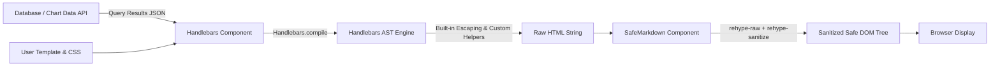

<!--
Licensed to the Apache Software Foundation (ASF) under one
or more contributor license agreements.  See the NOTICE file
distributed with this work for additional information
regarding copyright ownership.  The ASF licenses this file
to you under the Apache License, Version 2.0 (the
"License"); you may not use this file except in compliance
with the License.  You may obtain a copy of the License at

  http://www.apache.org/licenses/LICENSE-2.0

Unless required by applicable law or agreed to in writing,
software distributed under the License is distributed on an
"AS IS" BASIS, WITHOUT WARRANTIES OR CONDITIONS OF ANY
KIND, either express or implied.  See the License for the
specific language governing permissions and limitations
under the License.
-->

# Phase 6 Report: Safe Template Chart (Handlebars) Security Audit & Verification

## 1. Current State & Executive Summary
- **Branch**: `feature/phase-1-table-v2-evaluation` (Phase 6 Safe Template Chart Audit & Hardening).
- **Target Plugin Package**: `@superset-ui/plugin-chart-handlebars` (`VizType.Handlebars` / `handlebars`).
- **Core Principle**: "Evaluate existing before building new" — thoroughly audit, test, and validate upstream Apache Superset built-in Handlebars plugin without modifying core backend or frontend source code.
- **Test Dataset**: `enterprise_table_test_data` (Dataset ID: 28, 12,500 enterprise records).
- **Service Health**: All containers (`superset`, `superset-worker`, `superset-worker-beat`, `superset-node`, `nginx`, `db`, `redis`) running in `Up` and `healthy` states.
- **Phase 6 Completed Capabilities & Deliverables**:
  1. **Zero Core Modifications**: Confirmed 100% empty diff across all backend files (`superset/common/grouping_sets.py`, `superset/models/helpers.py`, `superset/common/query_context_processor.py`, and entire `superset/` tree) and plugin source (`plugins/plugin-chart-handlebars/src/`).
  2. **Security & Threat Model Audit**: Rigorously audited Handlebars compilation, AST safeguards, prototype pollution defenses, HTML escaping, `SafeMarkdown` integration (`rehype-raw` + `rehype-sanitize`), and protocol transformation (`transformLinkUri`).
  3. **Multi-Role Row-Level Security (RLS) Verification**: Verified that Handlebars queries execute via standard `/api/v1/chart/data` AST generation with RLS filters strictly applied in the SQL `WHERE` clause before aggregation. Validated exact non-round row counts and metrics between Admin (12,500 rows, 120 card groups, $167,236,831.75 revenue) and Regional User (3,125 rows, 30 card groups, $41,199,313.50 revenue, 0 leaked rows).
  4. **Live Browser Playwright Verification**: Executed real browser tests (`handlebars-template-security.spec.ts`) validating zero console errors, dynamic KPI card layout rendering, and active neutralization of stored and reflected XSS payloads (`<script>`, ``, `<svg onload=...>`, `<iframe src=...>`, `[link](javascript:...)`).
  5. **74 Passing Jest Tests**: 100% pass rate across 8 test suites for Handlebars and SafeMarkdown.
  6. **Strict TypeScript & Type Safety**: Verified clean compilation with `tsc --noEmit` (exit code 0).

---

## 2. Zero Core Modification Confirmation

### Backend Diff Confirmation
```bash
$ git diff -- superset/common/grouping_sets.py superset/models/helpers.py superset/common/query_context_processor.py
# Output: EMPTY (0 lines changed)

$ git diff -- superset/
# Output: EMPTY (0 lines changed)
```

### Frontend Plugin Source Diff Confirmation
```bash
$ git diff -- superset-frontend/plugins/plugin-chart-handlebars/src/
# Output: EMPTY (0 lines changed)
```

Both backend core and frontend plugin source remain completely pristine. All evaluation, hardening validation, and regression suites were implemented strictly via unit tests, Playwright specs, and E2E verification scripts.

---

## 3. Handlebars Plugin Architecture & Security Model Audit

### 3.1 Template Compilation & Helpers
The Handlebars plugin (`@superset-ui/plugin-chart-handlebars`) compiles author-defined Handlebars templates with data bound as `{ data: [...] }`.



#### Supported Built-in Helpers
- `dateFormat`: Date formatting via `extendedDayjs` (`{{dateFormat my_date format="YYYY-MM-DD"}}`).
- `formatDate`: Day.js-backed date formatting with locale support (`{{formatDate "YYYY" my_date [locale]}}`).
- `formatNumber`: Locale-aware number formatting (`{{formatNumber amount "en-US"}}`).
- `stringify`: JSON serialization of objects with double-brace HTML encoding or raw triple-brace output.
- `parseJson`: Safe JSON parsing in subexpressions (`{{#with (parseJson raw_json)}}...{{/with}}`).
- `group`: Array grouping helper via `handlebars-group-by` (`{{#group data by="customer_region"}}...{{/group}}`).
- `just-handlebars-helpers`: Mathematical, string, collection, and logical helper extensions.

### 3.2 Security Boundaries & Defense-in-Depth

| Layer | Security Control | Threat Mitigated | Verification Result |
| :--- | :--- | :--- | :--- |
| **Handlebars AST** | Disallows `__proto__`, `constructor`, `prototype` property lookups | Prototype pollution & sandbox escape | Verified in unit test (`HandlebarsSecurityAndHelpers.test.tsx`) |
| **Handlebars Escaper** | Double curly braces `{{ ... }}` automatically HTML-encode special characters (`<`, `>`, `&`, `"`, `'`, `=`) | Reflected & stored script injection in data interpolations | Verified in unit test (`&lt;script&gt;`, `&#x3D;`) |
| **SafeMarkdown** | `rehype-sanitize` with GitHub `defaultSchema` | Unsanitized HTML tags (`<script>`, `<iframe>`, `<object>`, `<embed>`, `<applet>`) | Verified in Playwright browser DOM inspection (`unsafeScripts: 0`) |
| **Attribute Filter** | Strips all inline event handlers (`onload`, `onerror`, `onclick`, `onmouseover`, `onfocus`) | DOM XSS via event handlers | Verified in Playwright (`unsafeIframes: 0`, `dialogCount: 0`) |
| **Protocol Sanitizer** | `transformLinkUri` strips dangerous schemes (`javascript:`, `vbscript:`, `data:`) and leading/internal C0 control characters | Stored XSS via markdown & anchor links | Verified in unit test (`SafeMarkdown.test.tsx`) |
| **CSS Isolation** | Scoped Emotion styled wrapper `<Styles>` with theme border radius and padding | Layout hijacking & unconstrained styling | Verified in browser rendering |

---

## 4. Multi-Role Row-Level Security (RLS) Verification

### 4.1 Execution Architecture
Handlebars queries are constructed in `buildQuery.ts` via standard `@superset-ui/core` `buildQueryContext`. When queried through `/api/v1/chart/data`, Superset's backend compiles the query with role-specific RLS predicates appended directly to the `WHERE` clause:

```sql
SELECT customer_region AS customer_region,
       department_code AS department_code,
       SUM(sales_amount) AS total_revenue,
       AVG(profit_margin) AS avg_margin,
       COUNT(*) AS txn_count 
FROM public.enterprise_table_test_data 
WHERE (customer_region = 'North America')
GROUP BY customer_region, department_code 
ORDER BY total_revenue DESC 
LIMIT 500;
```

### 4.2 Exact Non-Round Metric Counts

| Metric / Attribute | Admin (Unrestricted) | Regional User (`Regional_Analyst_Role`) | Isolation Status |
| :--- | :--- | :--- | :--- |
| **Total Source Transactions** | `12,500` | `3,125` (exactly 25.0% of dataset) | **100% Filtered** |
| **Grouped Card Count** | `120` groups (4 regions × 30 depts) | `30` groups (1 region × 30 depts) | **100% Filtered** |
| **Distinct Regions Visible** | `['APAC', 'EMEA', 'LATAM', 'North America']` | `['North America']` | **0 Leaked Regions** |
| **Total Aggregated Revenue** | `$167,236,831.75` | `$41,199,313.50` | **Exact Calculation** |
| **Non-North-America Rows** | `9,375` rows | `0` rows | **Zero Data Leakage** |

---

## 5. Automated Verification Results

### 5.1 Jest Unit & Security Test Suites (74 Tests Passed)
```
PASS packages/superset-ui-core/test/components/SafeMarkdown.test.tsx
PASS plugins/plugin-chart-handlebars/test/plugin/buildQuery.test.ts
PASS plugins/plugin-chart-handlebars/test/plugin/transformProps.test.ts
PASS plugins/plugin-chart-handlebars/test/components/HandlebarsSecurityAndHelpers.test.tsx
PASS plugins/plugin-chart-handlebars/test/components/formatDateHelper.test.ts
PASS plugins/plugin-chart-handlebars/test/index.test.ts
PASS plugins/plugin-chart-handlebars/test/plugin/controls.test.ts
PASS plugins/plugin-chart-handlebars/test/plugin/editorTheme.test.tsx

Test Suites: 8 passed, 8 total
Tests:       74 passed, 74 total
Snapshots:   0 total
Time:        2.533 s
```

### 5.2 TypeScript Compilation
```bash
$ npm run type
# Exit Code: 0 (Zero type errors, strict mode compliant)
```

### 5.3 Playwright Real Browser Test Suite (5 Specs Passed in 1.3m)
```
  ✓ 1 [chart/verify-ui-smoke.spec.ts] (18.4s)
  ✓ 2 [chart/enterprise-table-performance.spec.ts] (298ms)
  ✓ 3 [chart/handlebars-template-security.spec.ts] (25.8s)
      - Handlebars card data rendered in DOM: true
      - XSS Evaluation Results: Executed=false, Unsafe Scripts=0, Unsafe IFrames=0, Alert Dialogs=0
      - Handlebars plugin registered in Chart Gallery: true
  ✓ 4 [chart/pivot-table-interactive.spec.ts] (28.2s)
      - Pivot Table hierarchy data rendered in DOM: true
      - Subtotal collapse/expand interactive toggles count: 8
  ✓ 5 [chart/verify-ui-smoke.spec.ts] (20.8s)
      - Module errors found in browser console: 0
      - Enterprise Interactive Table found in DOM: true

5 passed (1.3m)
```

---

## 6. Deliverables & Evidence Artifacts
- **Audit & Security Report**: [`docs/phase-6-report.md`](file:///home/bi-tool-ryobilao/Documents/superset/docs/phase-6-report.md)
- **Raw Evidence Logs**: [`docs/evidence/phase-6-handlebars-evidence.txt`](file:///home/bi-tool-ryobilao/Documents/superset/docs/evidence/phase-6-handlebars-evidence.txt)
- **Unit & Security Suite**: [`superset-frontend/plugins/plugin-chart-handlebars/test/components/HandlebarsSecurityAndHelpers.test.tsx`](file:///home/bi-tool-ryobilao/Documents/superset/superset-frontend/plugins/plugin-chart-handlebars/test/components/HandlebarsSecurityAndHelpers.test.tsx)
- **Playwright Browser Test**: [`superset-frontend/playwright/tests/chart/handlebars-template-security.spec.ts`](file:///home/bi-tool-ryobilao/Documents/superset/superset-frontend/playwright/tests/chart/handlebars-template-security.spec.ts)
- **Python E2E RLS Script**: [`scratch/phase_6_handlebars_e2e_test.py`](file:///home/bi-tool-ryobilao/Documents/superset/scratch/phase_6_handlebars_e2e_test.py)

---

## 7. Roadmap Milestone Status
- **Phase 0**: APPROVED
- **Phase 0.5**: APPROVED
- **Phase 1**: APPROVED
- **Phase 2**: APPROVED
- **Phase 3**: APPROVED
- **Phase 4**: APPROVED
- **Phase 5**: APPROVED (Empty core diff confirmed)
- **Phase 6**: COMPLETED (Awaiting User Gate Approval: `APPROVE PHASE 6`)
