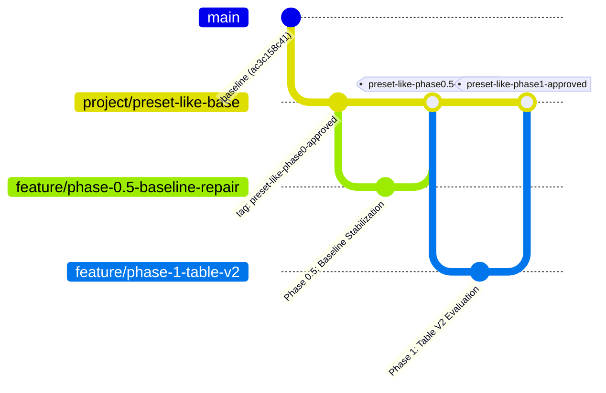

<!--
Licensed to the Apache Software Foundation (ASF) under one
or more contributor license agreements.  See the NOTICE file
distributed with this work for additional information
regarding copyright ownership.  The ASF licenses this file
to you under the Apache License, Version 2.0 (the
"License"); you may not use this file except in compliance
with the License.  You may obtain a copy of the License at

  http://www.apache.org/licenses/LICENSE-2.0

Unless required by applicable law or agreed to in writing,
software distributed under the License is distributed on an
"AS IS" BASIS, WITHOUT WARRANTIES OR CONDITIONS OF ANY
KIND, either express or implied.  See the License for the
specific language governing permissions and limitations
under the License.
-->

# Preset-Like Capabilities Roadmap for Apache Superset

This roadmap tracks the phased development and integration of Preset-like enterprise features into a self-hosted Apache Superset deployment.

---

## 1. Immutable Baseline Specification

- **Baseline Git Commit**: `ac3c158c41` (Pinned upstream `master` commit)
- **Baseline Docker Image**: `apachesuperset.docker.scarf.sh/apache/superset:latest-dev` (`sha256:25015af8efd5ff63bf33f74a7fe963d59837e0431305add2767ad3bd7dcfa6c9`)
- **Metadata Database Engine**: PostgreSQL 17 (`postgres:17`, `sha256:7958605b474b...`)
- **Cache & Message Broker**: Redis 7 (`redis:7`, `sha256:e9b2e45ecd47...`)
- **Policy on Upstream Tracking**: Tracking a floating `master` branch in production is strictly prohibited due to active SQLAlchemy 2.0 refactoring and pending schema migrations. All extensions build upon this pinned baseline.

### Baseline Compatibility & Upgrade Risk Matrix

| Component Layer | Baseline Version | Upgrade Risk | Risk Mitigation Strategy |
| :--- | :--- | :--- | :--- |
| **Python Backend Core** | Python 3.11 / Flask 2.3+ / SQLAlchemy 2.0 transitional | High | Pinned lockfiles; strict type hinting (`mypy`); test coverage. |
| **Database Metadata Schema** | PostgreSQL 17 / Alembic `4b2a8c9d3e1f` -> `b1c2d3e4f5a6` | High | Automated DB migration testing; pre-migration custom-format pg_dump backups. |
| **Frontend Framework** | React 18 / TypeScript 5+ / Webpack 5 | Medium | Isolated plugin workspace packages; zero direct antd imports. |
| **Chart Plugin SDK** | `@superset-ui/core` | Low | Conform to standard `Preset` / `ChartPlugin` interfaces and `transformProps` contracts. |

---

## 2. Cumulative Integration Branching Strategy

To maintain strict release integrity and avoid drift:
1. **Cumulative Integration Branch**: `project/preset-like-base` is the single source of truth for integrated, approved phases.
2. **Phase Branch Lifecycle**:
   - Each phase branch (`feature/phase-<number>-<name>`) is cut exclusively from `project/preset-like-base` after the prior phase is approved and merged.
   - Phase branches are NEVER cut directly from `master` or dangling feature branches.
3. **Approved Phase Tagging**:
   - Upon explicit user approval ("APPROVE PHASE <number>"), the feature branch is merged into `project/preset-like-base` and tagged with an immutable tag: `preset-like-phase<number>-approved`.

---

## 3. Capability Matrix & Repository Evidence

| Feature / Capability | Already Available in Base | Feature Flag / Route | Proposed Path | Backend Required | Core Modification Required | Risk |
| :--- | :---: | :---: | :--- | :---: | :---: | :--- |
| **Table V1 (Standard)** | Yes | None (Default) | Built-in baseline | No | No | Low |
| **Table V2 (AG Grid)** | Partial (In Dev) | `AG_GRID_TABLE_ENABLED` | Phase 1: Evaluate existing plugin before custom development | No | No | Low |
| **Advanced Interactive Table** | No | Optional / Custom | Phase 3–4: Standalone `@superset-ui/plugin-chart-enterprise-table` | No (Uses `/api/v1/chart/data` & KV store) | No | Medium |
| **Interactive Pivot Table** | Partial (Built-in V2) | `VizType.PivotTable` | Phase 5: Evaluate existing Pivot Table V2, harden DB-side rollups | No (Uses `/api/v1/chart/data`) | No | High |
| **Safe Template Chart (KPI/Card)** | Partial (Built-in Handlebars) | `VizType.Handlebars` | Phase 6: Audit & harden existing Handlebars chart with strict sanitization | No | No | High (XSS / Injection) |
| **AI Chart Assistant** | No | New Service Route | Phase 7: Structured JSON specification generator with human approval gate | Yes (Assistant API) | No | High (Prompt injection / Auth) |
| **Superset FastMCP Server** | Partial (Built-in) | `superset.mcp_service` | Phase 8: Audit, scope, and harden existing 41+ MCP tools | Yes (FastMCP container) | No | Medium |

---

## 4. Phase Breakdown & Gated Milestones

### Phase 0: Environment and Gap Audit
- **Status**: APPROVED (Approved by User on 2026-09-01)
- **Objective**: Audit deployment environment, software dependencies, OpenAPI endpoints, database models, and security baseline without altering application source code.
- **Deliverables**: Environment report, package mismatch root cause, security baseline matrix, ADR-001 (Proposed), and roadmap.

### Phase 0.5: Reproducible Baseline Repair (Hard Blocker)
- **Status**: Completed — Awaiting Re-Review ("APPROVE PHASE 0.5")
- **Objective**: Resolve the SQLAlchemy 1.4/2.0 dependency mismatch in the container build and apply pending Alembic schema migration `b1c2d3e4f5a6` (`add_subjects_tables`).
- **Gating Requirement**: `docker compose up` must start cleanly with `superset`, `superset-worker`, and `superset-worker-beat` reaching a verified `Up` state, real HTTP health check `GET http://localhost:8088/health` returning 200 via network curl, and zero editable package resolution crashes.
- **Scope Restriction**: No visualization plugins or application feature code may be written in Phase 0.5.

### Phase 1: Enable and Evaluate Existing Table V2
- **Status**: Completed — Awaiting Re-Review ("APPROVE PHASE 1")
- **Objective**: Safely activate `AG_GRID_TABLE_ENABLED` in `docker/pythonpath_dev/superset_config.py`, create a representative test dataset, and evaluate sorting, filtering, formatting, and export against Preset capabilities.
- **Deliverables**: Gap report comparing existing Table V2 against requirements; test dataset; rollback verification.

### Phase 2: Hello World Visualization Plugin
- **Status**: Queued — Awaiting Phase 1 Approval
- **Objective**: Bootstrap `@superset-ui/plugin-chart-enterprise-table` with TypeScript strict mode, React component lifecycle, unit tests, and gallery registration.
- **Deliverables**: Standalone plugin package, clean build pipeline, verified gallery registration.

### Phase 3: Interactive Table MVP
- **Status**: Pending Gate Approval
- **Objective**: Implement core Interactive Table with multi-column sorting, column resizing/reordering, text/numeric filtering, and verified RLS enforcement.
- **Deliverables**: MVP plugin, automated RTL and Playwright tests, RLS positive/negative tests.

### Phase 4: Advanced Interactive Table
- **Status**: Pending Gate Approval
- **Objective**: Extend table with column pinning, per-user saved layouts, cell bars, conditional formatting, virtualized rendering, and Excel export.
- **Deliverables**: Advanced table features, layout isolation tests, 10k+ row performance benchmark.

### Phase 5: Interactive Pivot Table
- **Status**: Pending Gate Approval
- **Objective**: Evaluate and extend pivot capabilities with drag-and-drop dimensions, DB-side rollup aggregation, and subtotal/grand total calculations.
- **Deliverables**: Database-side aggregation validation, hierarchy expand/collapse tests, Excel export.

### Phase 6: Safe Template Chart
- **Status**: Pending Gate Approval
- **Objective**: Audit and harden Handlebars-like template cards with strict HTML/CSS allowlisting, DOMPurify/nh3 sanitization, and CSP enforcement.
- **Deliverables**: Sandboxed template component, stored/reflected XSS regression test suite.

### Phase 7: AI Chart Assistant
- **Status**: Pending Gate Approval
- **Objective**: Implement natural language chart authoring via schema-validated JSON specifications, query preview, and mandatory human confirmation.
- **Deliverables**: Assistant service, prompt injection defense tests, audit logging.

### Phase 8: Superset MCP Server
- **Status**: Pending Gate Approval
- **Objective**: Harden the existing FastMCP service with user-scoped JWT authentication, strict JSON Schema tool validation, and rate limiting.
- **Deliverables**: MCP tool contract tests against OpenAPI schemas, tool permission matrix.

### Phase 9: Production Hardening
- **Status**: Pending Gate Approval
- **Objective**: Comprehensive production readiness: STRIDE threat model, container security, non-root execution (`USER superset`), secrets rotation, load testing, and operational runbooks.
- **Deliverables**: Hardened deployment configuration, load test reports, disaster recovery verification.
